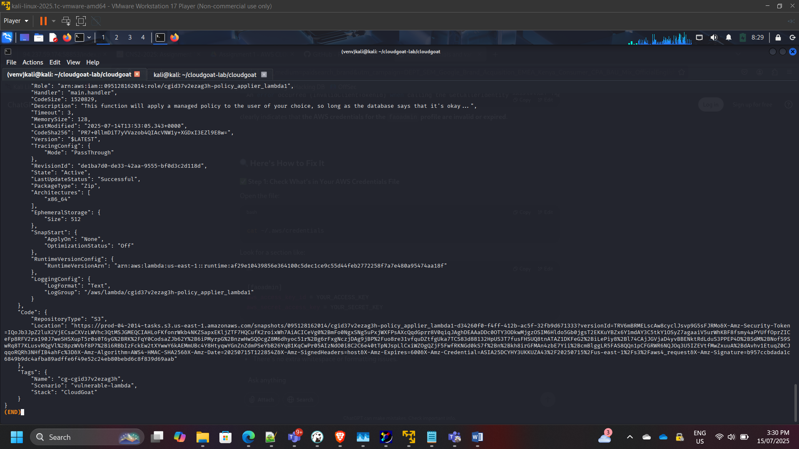
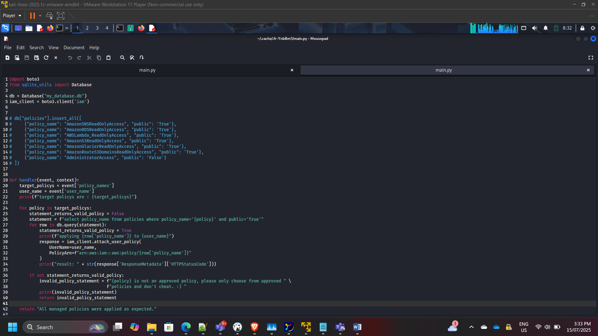
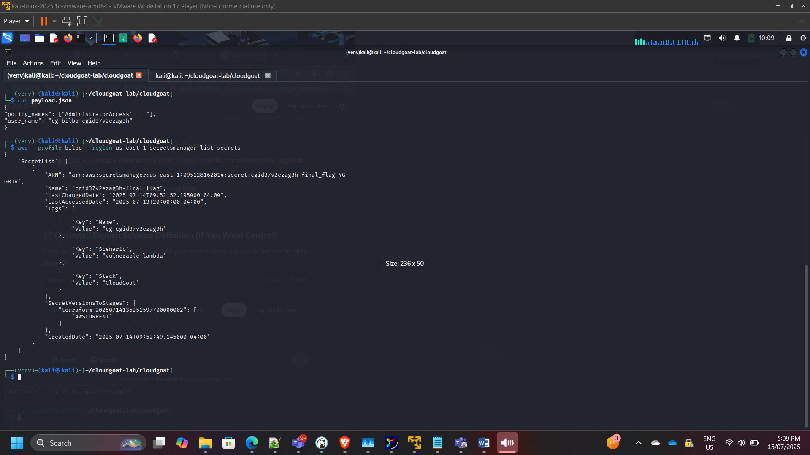
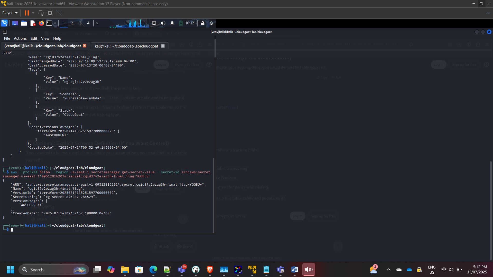

## Project: Serverless Privilege Escalation via Insecure Lambda Function

**Timeline:** July 2025  
**Role:** Cloud Security Analyst (Application & IAM Security Assessment)  
**Focus:** IAM Role Assumption, Serverless Code Vulnerabilities, Privilege Escalation, Secrets Exposure  
**Tools:** AWS CLI, IAM, Lambda, Secrets Manager, CloudGoat  

---

## Executive Summary

Conducted a structured security assessment of a vulnerable AWS Lambda function to evaluate risks associated with insecure serverless development practices.

Starting from a low-privileged IAM user (`bilbo`), I identified a Lambda function that dynamically applied IAM policies based on unsanitized user input. By crafting a malicious payload, I was able to escalate privileges to administrator level and access sensitive secrets stored in AWS Secrets Manager.

The exercise demonstrated how improper input validation in serverless functions can lead to full account compromise.

---

## Assessment Scope

The security analysis covered:

- IAM user permissions enumeration  
- Role discovery and trust relationship analysis  
- Lambda invocation permissions  
- Lambda source code review  
- Injection vulnerability exploitation  
- Secrets Manager access escalation  

---

# Phase 1: IAM Enumeration & Permission Analysis

Confirmed current identity:

aws sts get-caller-identity  

Reviewed attached user policies and permissions.

Identified ability to assume additional roles.

---

# Phase 2: Role Discovery & Assumption

Enumerated available roles:

aws iam list-roles  

Identified role:  
`cg-lambda-invoker-<id>`

Reviewed attached policies and trust relationships.

Assumed privileged role:

aws sts assume-role  

Validated temporary credentials and access scope.

---

# Phase 3: Lambda Enumeration

Listed Lambda functions:

aws lambda list-functions  

Identified target vulnerable Lambda function.

Retrieved function metadata and execution role details.

---

# Phase 4: Source Code Analysis

Downloaded and reviewed Lambda function code.

Observed vulnerable logic:

Statement = f"select policy_name from policies where policy_name='{policy}' and public='True'"

The function dynamically constructed database queries using unsanitized input.

### Security Weakness Identified

- SQL injection vulnerability  
- Lack of input validation  
- Direct policy manipulation  
- Improper trust boundary enforcement  

---

# Phase 5: Exploitation & Privilege Escalation

Crafted injection payload to bypass policy restrictions.

Invoked Lambda with malicious input:

aws lambda invoke --payload '<injection_payload>'

Successfully escalated IAM user privileges to Administrator.

Verified expanded access:

aws iam list-attached-user-policies  

---

# Phase 6: Secrets Manager Access

With elevated privileges, enumerated secrets:

aws secretsmanager list-secrets  

Retrieved secret value:

aws secretsmanager get-secret-value  

---

# Attack Path Summary

Low-Privilege IAM User → Role Assumption → Lambda Code Analysis → Injection Exploit → Policy Escalation → Secrets Manager Access

This demonstrated how insecure serverless code can compromise IAM boundaries and lead to full administrative access.

---

# Security Risks Identified

- Insecure dynamic query construction  
- Lack of input validation  
- Over-permissioned Lambda execution role  
- Weak separation of trust boundaries  
- Insufficient policy scoping  

---

# Remediation Recommendations

- Enforce strict input validation  
- Use parameterized queries  
- Apply IAM least privilege to Lambda roles  
- Separate policy management functions  
- Implement logging & anomaly detection  
- Conduct regular serverless code reviews  
- Enable CloudTrail monitoring for privilege changes  

---

# Security Competencies Demonstrated

- IAM role assumption analysis  
- Trust relationship inspection  
- Serverless code vulnerability review  
- Privilege escalation path mapping  
- Secrets exposure assessment  
- Cloud-native application security  

---

## Conclusion

This assessment highlighted how insecure coding practices in serverless architectures can undermine IAM security controls.

The exercise reinforced the importance of:

- Secure software development practices  
- Least privilege IAM enforcement  
- Strict boundary control between user input and policy logic  
- Continuous cloud security monitoring  

It demonstrates practical understanding of application-layer security risks in AWS serverless environments.

---

[Back to Security Projects](/projects/security/)
