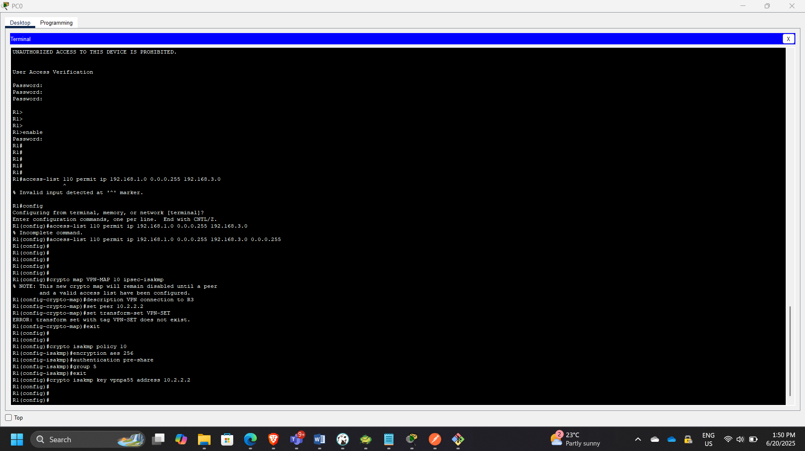
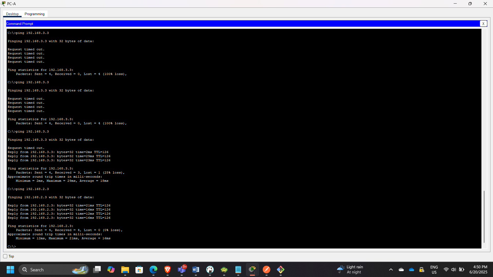

## Project: Site-to-Site IPsec VPN Configuration & Verification

**Timeline:** June 2025  
**Role:** Network & Cloud Security Engineer  
**Focus:** Network-Layer Encryption, Secure Tunnel Establishment, IPsec & ISAKMP Configuration  
**Technologies:** Cisco IOS, IPsec, ISAKMP (IKEv1), ACLs, Crypto Maps  

---

## Executive Summary

Designed and configured a **site-to-site IPsec VPN tunnel** between two remote networks using Cisco routers to secure communication over an untrusted intermediary network.

The implementation included:

- Enabling router security features  
- Configuring ISAKMP Phase 1 (IKE negotiation)  
- Configuring IPsec Phase 2 parameters  
- Defining interesting traffic using ACLs  
- Applying crypto maps to outbound interfaces  
- Verifying encrypted traffic using security associations  

This project demonstrates practical knowledge of encrypted network connectivity and secure inter-site communication.

---

# Architecture Overview

The topology consisted of:

- **R1 (Site A)**
- **R2 (Untrusted Transit Network)**
- **R3 (Site B)**

Two remote LANs were connected securely through an IPsec tunnel established between R1 and R3.

---

# Part 1: Enabling Security Features

## Step 1: Verify Security License

Checked whether security features were enabled:

show license

Security initially disabled.

---

## Step 2: Enable Securityk9

Enabled security package:

license boot module c1900 technology-package securityk9

Verified activation.

Repeated the same steps on R3.

---

# Part 2: Configuring IPsec on R1

---

## Step 1: Test Initial Connectivity

Before configuration:

Ping from PC-A → PC-C  
Traffic passed in cleartext (no encryption).

---

## Step 2: Define Interesting Traffic

Configured ACL 110 to identify LAN-to-LAN traffic:

access-list 110 permit ip <LAN-R1> <LAN-R3>

This ensures only specified traffic is encrypted.

---

## Step 3: Configure ISAKMP (Phase 1)

Configured IKE Phase 1 parameters:

- Encryption: 3DES
- Hash: SHA
- Authentication: Pre-shared key
- DH Group
- Lifetime

Configured shared key:

crypto isakmp key cisco address <peer-ip>

---

## Step 4: Configure IPsec (Phase 2)

Created transform set:

crypto ipsec transform-set VPN-SET esp-3des esp-sha-hmac

Created crypto map:

crypto map VPN-MAP 10 ipsec-isakmp  
 set peer <peer-ip>  
 set transform-set VPN-SET  
 match address 110  

---

## Step 5: Apply Crypto Map

Bound crypto map to outbound interface:

interface Serial0/0/0  
 crypto map VPN-MAP  

---

# Part 3: Mirror Configuration on R3

Performed reciprocal configuration:

- Defined matching ACL
- Configured ISAKMP policy
- Configured transform set
- Created crypto map
- Applied crypto map to outbound interface

---

# Part 4: Tunnel Verification

---

## Step 1: Verify Before Traffic

show crypto ipsec sa

No active Security Associations.

---

## Step 2: Generate Interesting Traffic

Ping PC-C from PC-A.

This triggered ISAKMP negotiation and IPsec tunnel creation.

---

## Step 3: Verify Encrypted Traffic

show crypto ipsec sa

Observed:

- Encapsulated packets
- Encrypted packets
- Decapsulated packets

---

## Step 4: Verify Uninteresting Traffic

Ping PC-B from PC-A.

No change in encryption counters — confirming only defined traffic is encrypted.

---

# Security Concepts Demonstrated

- Network-layer encryption using IPsec
- ISAKMP (IKEv1) Phase 1 negotiation
- IPsec Phase 2 secure tunnel establishment
- Crypto map binding
- Access Control List-based traffic classification
- Secure communication across untrusted networks

---

# Security & Architectural Relevance

This project demonstrates:

- Secure branch-to-branch connectivity
- Hybrid cloud VPN concepts
- Encryption over public infrastructure
- Controlled traffic encryption policies
- Practical understanding of tunnel establishment lifecycle

---

# Conclusion

This exercise successfully implemented and verified a secure site-to-site IPsec VPN between two remote networks. By applying ISAKMP and IPsec configurations with defined "interesting traffic," encrypted communication was established across an untrusted network.

The lab reinforced practical understanding of network-layer encryption, secure tunnel lifecycle, and enterprise-grade VPN deployment principles.

---

[Back to Security Projects](/projects/security/)
