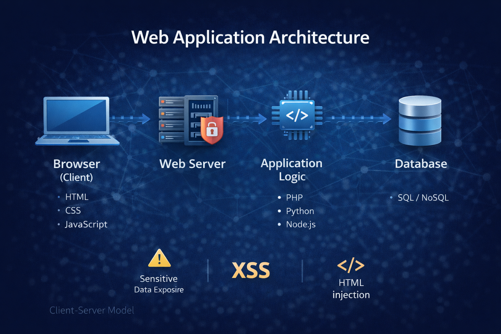
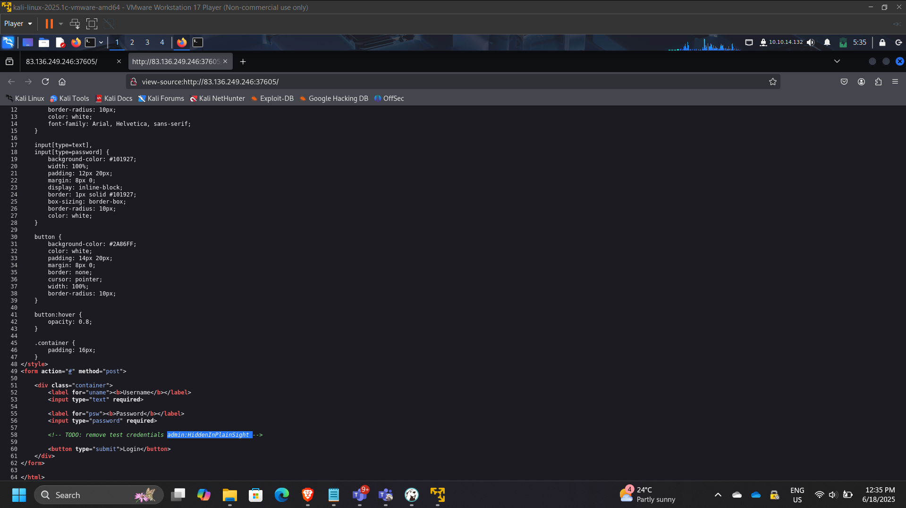
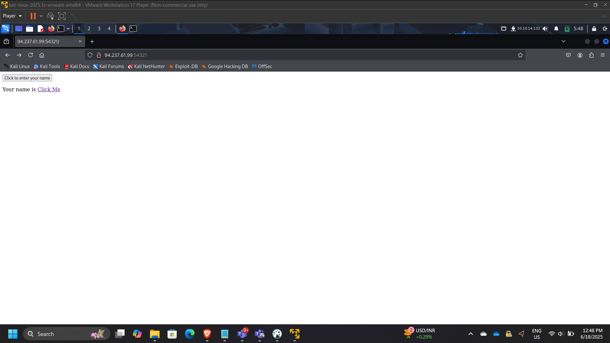
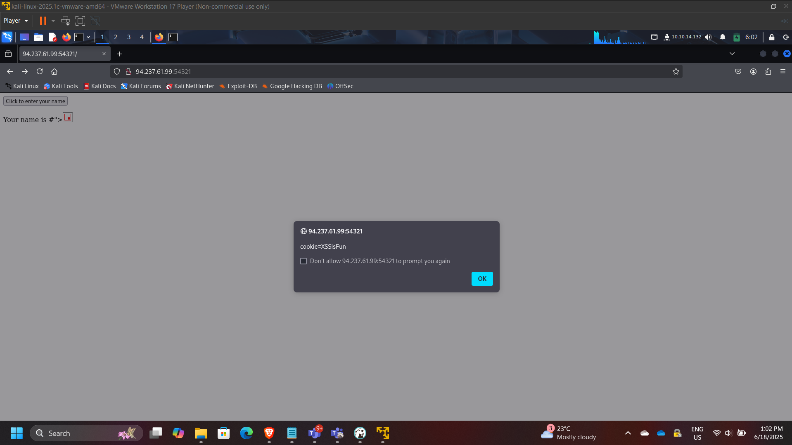
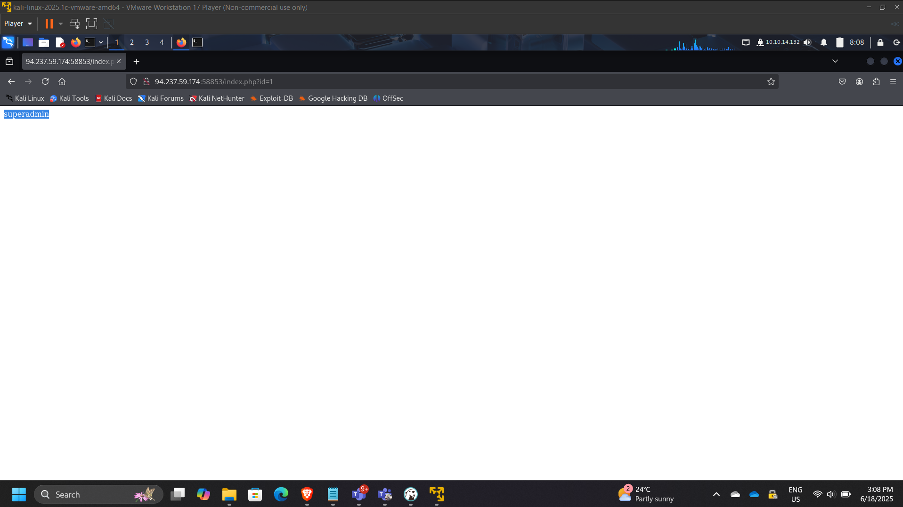
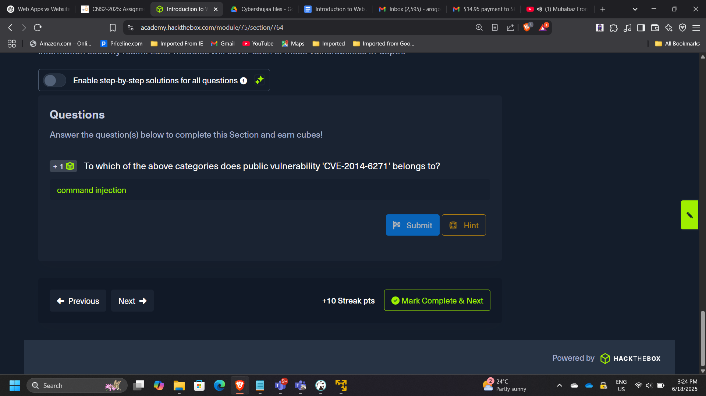
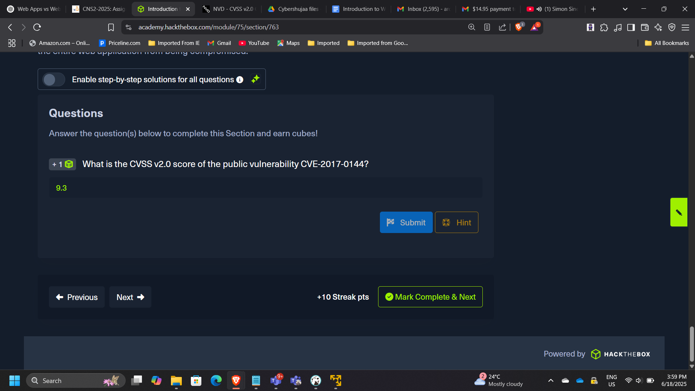

## Project: Web Application Security Fundamentals & Vulnerability Analysis

**Timeline:** June 2025  
**Role:** Web Application Security Analyst  
**Platform:** HackTheBox Academy  
**Focus:** XSS, Injection Attacks, Sensitive Data Exposure, HTTP & API Analysis  

---

## Executive Summary

Conducted foundational web application security analysis covering front-end components, HTTP behavior, input handling weaknesses, and common exploitation vectors including HTML injection, Cross-Site Scripting (XSS), and command injection.

This project demonstrates practical understanding of how insecure web applications can be exploited and how vulnerabilities are classified and mitigated.

---

# Web Application Architecture

Web applications follow a layered client-server model:

- Browser (Client)
- Web Server
- Application Logic
- Database

---

# Sensitive Data Exposure Analysis

Inspected login form source code to detect exposed credentials.

Identified embedded password value:

HiddenInPlainSight

### Security Risk:
Exposed credentials in client-side source can lead to unauthorized access.

---

# HTML Injection Testing

Submitted the following payload:

<a href="http://www.hackthebox.com">Click Me</a>

Observed rendered output:

Your name is Click Me

### Security Impact:
Improper input sanitization allows arbitrary HTML rendering.

---

# Cross-Site Scripting (XSS) Exploitation

Injected JavaScript payload to retrieve session cookie.

Retrieved cookie value:

XSSisFun

### Security Risk:
- Session hijacking
- Credential theft
- Persistent client-side compromise

---

# Parameter Tampering & ID Enumeration

Tested GET parameter manipulation:

/index.php?id=0

Discovered elevated user:

superadmin

### Security Risk:
Broken access control due to insufficient server-side validation.

---

# CVE & Vulnerability Research

## CVE-2014-6271

Classified under:

Command Injection

---

## CVSS Severity Assessment

CVE-2017-0144 (EternalBlue)

CVSS v2 Score: 9.3

Demonstrates ability to interpret vulnerability severity metrics.

---

# Key Security Concepts Demonstrated

- Client-side vs server-side trust boundaries
- Input validation failures
- Output encoding importance
- HTTP status code interpretation
- CVE classification and scoring
- Web attack surface analysis

---

# Enterprise Relevance

Modern cloud systems are heavily API-driven and web-based.  
Understanding web-layer vulnerabilities directly supports:

- Secure cloud application design
- WAF rule configuration
- API gateway protection
- DevSecOps pipelines
- Zero Trust architecture

---

## Conclusion

This project strengthened foundational knowledge of web application architecture and common vulnerability classes. By exploiting injection vectors and analyzing vulnerability severity, the lab reinforced the importance of secure coding practices and proactive security testing in modern web-based environments.

---

[Back to Security Projects](/projects/security/)
