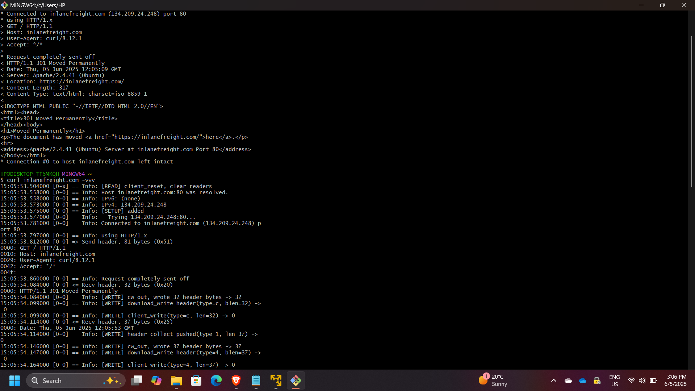
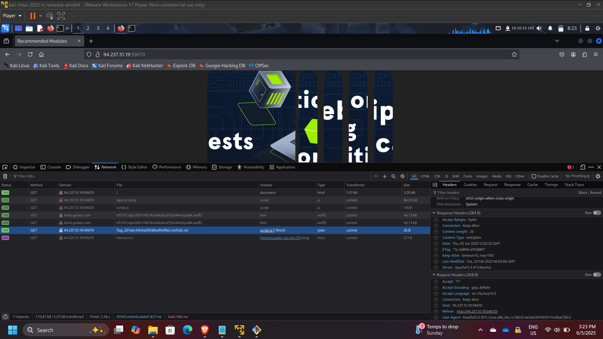
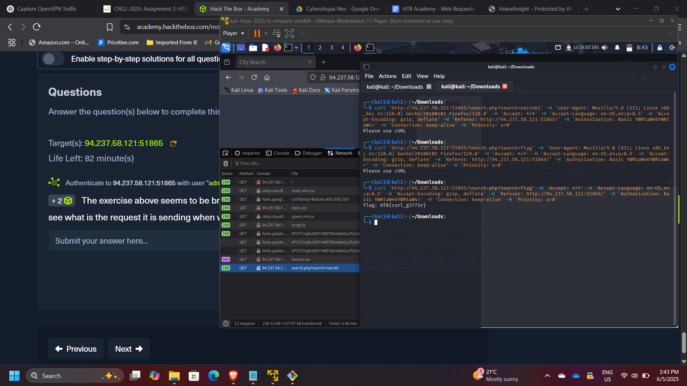
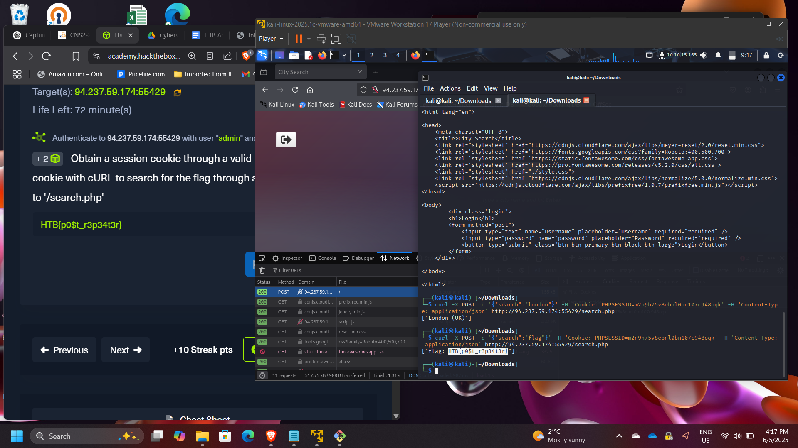
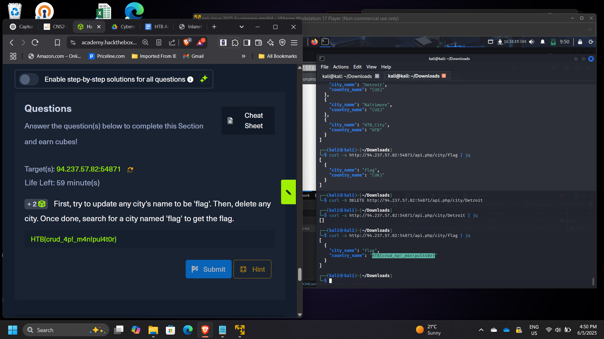

## Web Requests Analysis & HTTP Protocol Manipulation using cURL

**Timeline:** June 2025  
**Role:** Web Application Security Analyst  
**Skills:** HTTP, cURL, API Testing, Request Manipulation, Web Debugging, Session Handling, DevTools

---

### Project Summary

This project focused on analyzing and manipulating **web requests using HTTP and cURL** through hands-on labs from Hack The Box Academy.  

The objective was to understand how web applications communicate over HTTP and to interact directly with servers by crafting and modifying requests. This included working with different HTTP methods, headers, cookies, and API interactions.

The project simulated real-world scenarios relevant to **web security testing, API interaction, and penetration testing**, demonstrating how attackers and defenders analyze web traffic.

---

### Objectives

- Understand the structure and behavior of HTTP communication  
- Analyze HTTP requests and responses  
- Use **cURL** to interact with web servers  
- Inspect and manipulate HTTP headers and cookies  
- Perform GET and POST requests manually  
- Interact with APIs using CRUD operations  
- Use browser DevTools to monitor network traffic  

---

### Implementation & Highlights

#### 1. HTTP Fundamentals
- Explored how HTTP operates as an application-layer protocol  
- Understood:
  - DNS resolution → HTTP request → HTTP response  
  - URL structure and resource access  
- Observed how clients communicate with web servers  

---

#### 2. HTTP Requests & Responses
- Intercepted HTTP requests and identified:
  - Request method: **GET**  
  - Server response details  
- Extracted server information:
  - Apache version: **2.4.41**  

---

#### 3. HTTP Header Analysis
- Used browser DevTools (Network tab) to inspect requests  
- Identified hidden requests made after page load  
- Extracted sensitive data from HTTP responses  

---

#### 4. GET Request Manipulation
- Analyzed how search functionality sends requests  
- Recreated requests using cURL  
- Retrieved hidden data by modifying parameters  

Example:
- Queried server using cURL to extract hidden content  

---

#### 5. POST Request & Session Handling
- Authenticated to obtain a **session cookie**  
- Used the session cookie in cURL requests  
- Performed **JSON-based POST requests** to retrieve data  

Key concept:
- Session reuse for authenticated requests  

---

#### 6. API Interaction (CRUD Operations)
- Interacted with a web API using:
  - Create  
  - Read  
  - Update  
  - Delete  
- Manipulated application data to retrieve hidden information  
- Demonstrated how improper API controls can expose sensitive data  

---

### Results & Impact

- Successfully analyzed and manipulated HTTP requests  
- Demonstrated ability to:
  - Intercept and modify web traffic  
  - Extract hidden or sensitive data  
  - Work with authenticated sessions and cookies  
  - Interact with APIs using structured requests  
- Strengthened understanding of **web application behavior and attack surfaces**

---

### Tools & Technologies Used

- **cURL** – HTTP request execution and automation  
- **Browser DevTools** – Network traffic inspection  
- **HTTP Protocol** – Request/response analysis  
- **Web APIs** – CRUD interaction and testing  

---

### Outcome

This project demonstrated the ability to analyze, craft, and manipulate web requests using HTTP and cURL.  

It strengthened practical skills in **web application security testing, API interaction, and traffic inspection**, which are essential for roles in **web security, penetration testing, and cloud application security**.

---

[Back to Security Projects](/projects/security/)
