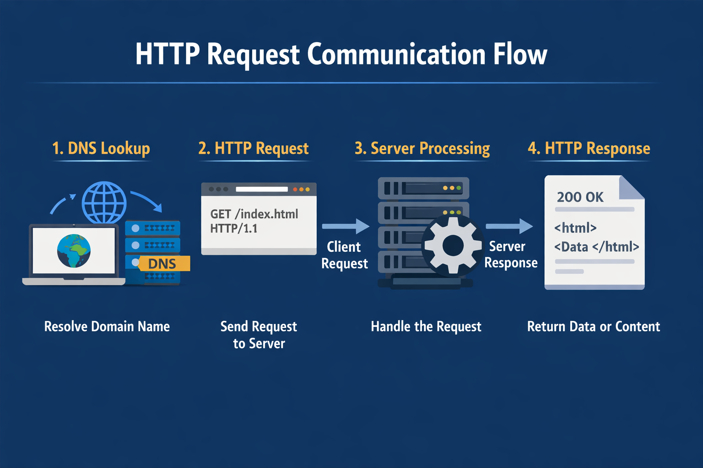
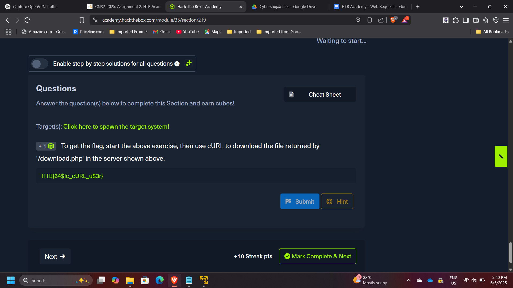

## Project: Web Application Traffic Analysis & HTTP Request Manipulation

**Course:** Cloud and Network Security  
**Platform:** HackTheBox Academy  
**Role:** Web Application Security Analyst  
**Focus:** HTTP Protocol Analysis, Request Manipulation, API Interaction

---

## Executive Summary

This project explores the fundamentals of web communication by analyzing and manipulating HTTP requests using browser developer tools and command-line utilities. Through practical exercises on HackTheBox Academy, I examined how web applications process requests and responses, how HTTP headers control server behavior, and how APIs expose functionality through HTTP endpoints.

Using tools such as **cURL** and **browser network monitoring**, I demonstrated how HTTP methods, headers, cookies, and request payloads can be modified to interact with server resources. The lab also included performing **GET, POST, and CRUD API operations**, highlighting how web applications expose functionality through structured HTTP communication.

Understanding these mechanisms is essential for both **web application development and security testing**, as it enables analysts to detect vulnerabilities, test APIs, and automate interactions with web services.

---

## Web Request Communication Flow

A typical HTTP interaction follows these steps:

1. Client resolves a domain using DNS.
2. Browser sends an HTTP request to the web server.
3. The server processes the request.
4. The server returns an HTTP response containing data or resources.

---

## Part 1: HyperText Transfer Protocol (HTTP)

HTTP is an application-layer protocol responsible for transmitting data between clients and servers.

In this exercise, the objective was to retrieve a hidden resource using **cURL**.

Example command used:

    curl http://target-server/download.php

This command allowed direct retrieval of the resource returned by the server endpoint.

**Flag retrieved:** `HTB{64$!c_cURL_u$3r}`

---

## Part 2: HTTP Requests and Responses

HTTP communication consists of two primary components:

- Request
- Response

Using browser developer tools, I intercepted the request sent by the browser and identified the HTTP method used.

**HTTP Method Observed:** `GET`

By inspecting the response headers returned by the server, I identified the version of the Apache web server running.

**Server version identified:** `2.4.41`

---

## Part 3: HTTP Headers Analysis

HTTP headers contain metadata describing how requests and responses should be handled by clients and servers.

Using the **Network tab in browser developer tools**, I monitored the requests generated by the webpage and identified the request responsible for retrieving the flag.

**Flag discovered through request inspection:** `hTB{p493_r3qu3$t$_m0n!t0r}`

---

## Part 4: GET Request Manipulation

In this stage, the application appeared to return incorrect search results. By inspecting the request generated by the browser, I identified the query parameter used for searching.

I then reproduced the request using **cURL** and manually modified the parameter.

Example command:

    curl http://target-server/search.php?query=flag

**Flag retrieved:** `HTB{curl_g3773r}`

---

## Part 5: POST Request Manipulation

In this exercise, the objective was to perform a search operation through a POST request.

Steps performed:

1. Logged into the application to obtain a session cookie
2. Captured the cookie from browser developer tools
3. Used the cookie in a cURL POST request
4. Submitted a JSON payload to the API endpoint

Example command:

    curl -X POST http://target-server/search.php \
    -H "Cookie: session=XXXX" \
    -H "Content-Type: application/json" \
    -d '{"search":"flag"}'

**Flag retrieved:** `HTB{p0$t_r3p34t3r}`

---

## Part 6: CRUD API Manipulation

The final challenge involved interacting with a web API that supports CRUD operations:

- Create
- Read
- Update
- Delete

The objective was to manipulate API data by performing the following steps:

1. Update a city name to "flag"
2. Delete an existing city
3. Search for the newly created entry

After completing the API operations, the application returned the final flag.

**Flag retrieved:** `HTB{crud_4p!_m4n!pul4t0r}`

---

## Security Concepts Demonstrated

This project demonstrates several important web security concepts:

- HTTP request and response analysis
- Web traffic monitoring
- Parameter manipulation
- API interaction testing
- Session cookie usage
- Browser developer tools for security analysis
- Command-line automation using cURL

These techniques are commonly used during **web penetration testing and API security assessments**.

---

## Enterprise Relevance

Modern applications rely heavily on APIs and HTTP-based communication. Security professionals must understand how these requests operate in order to detect vulnerabilities such as:

- Broken authentication
- Parameter tampering
- API misuse
- Session hijacking
- Information disclosure through headers

Analyzing HTTP traffic and manipulating requests helps security teams identify weaknesses before attackers exploit them.

---

## Conclusion

This project provided hands-on experience analyzing and manipulating HTTP requests through multiple techniques, including browser developer tools and command-line utilities such as cURL. By exploring GET and POST methods, HTTP headers, cookies, and API interactions, I gained deeper insight into how web applications communicate with servers.

The exercise strengthened my understanding of **web application behavior, API communication, and HTTP traffic analysis**, all of which are critical skills for **web security testing and vulnerability assessment**.

---

[Back to Security Projects](/projects/security/)
