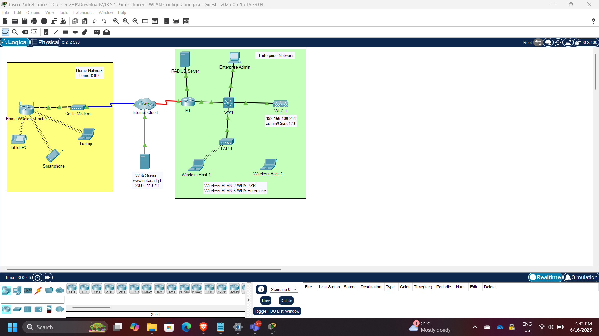
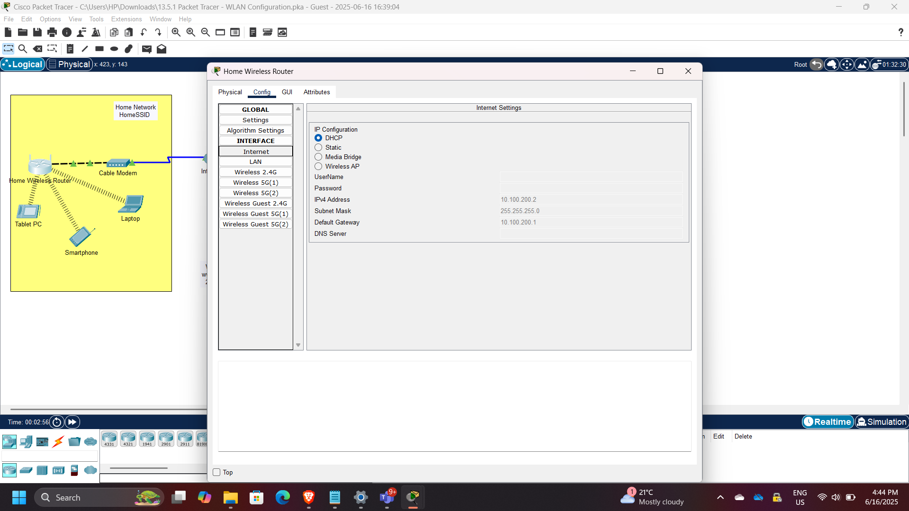
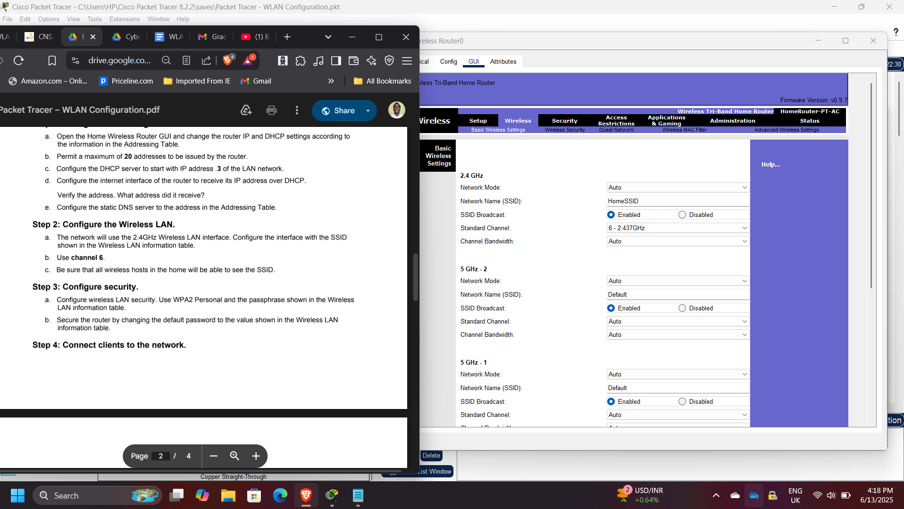
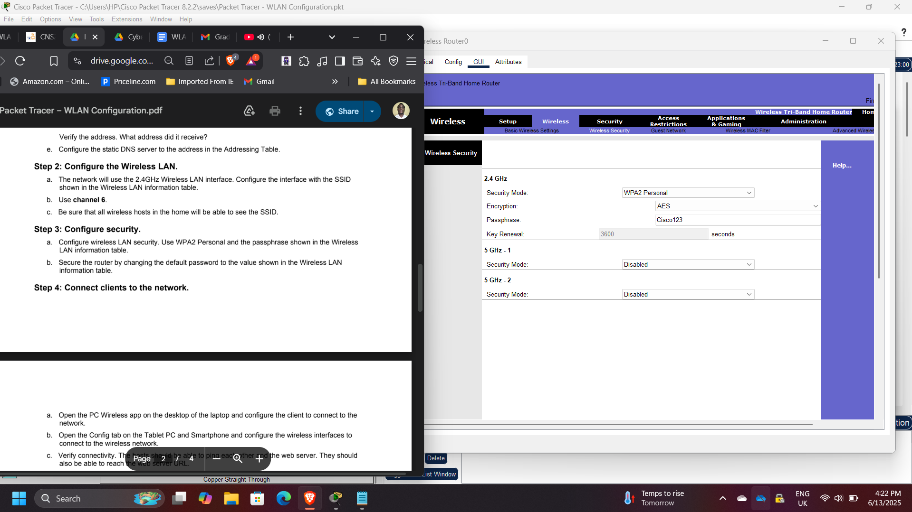
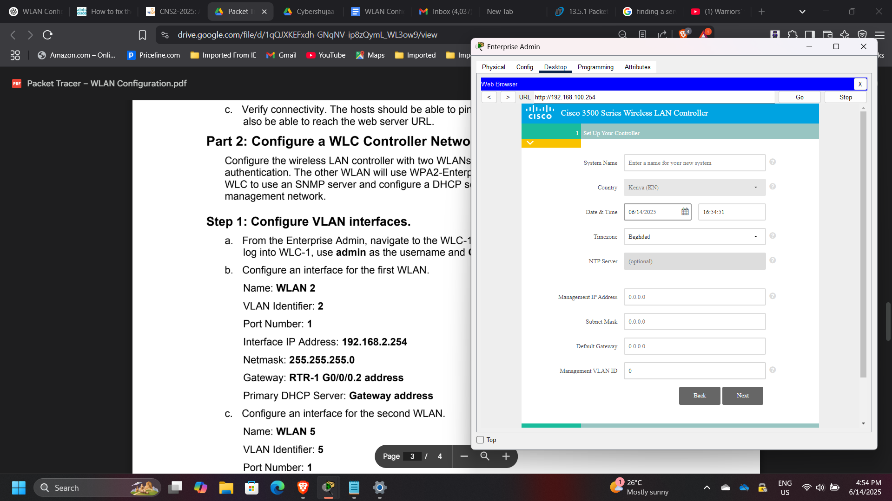
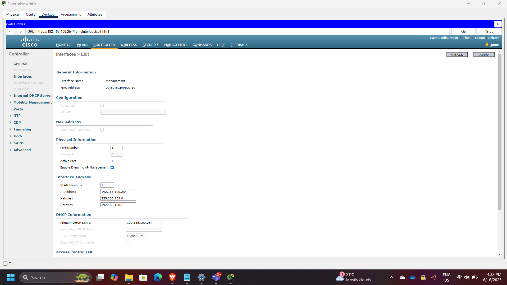
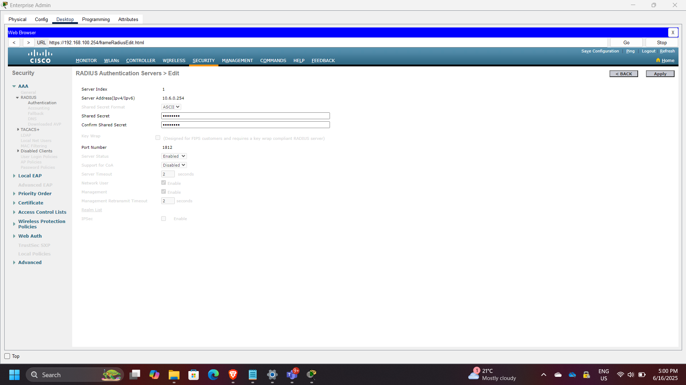
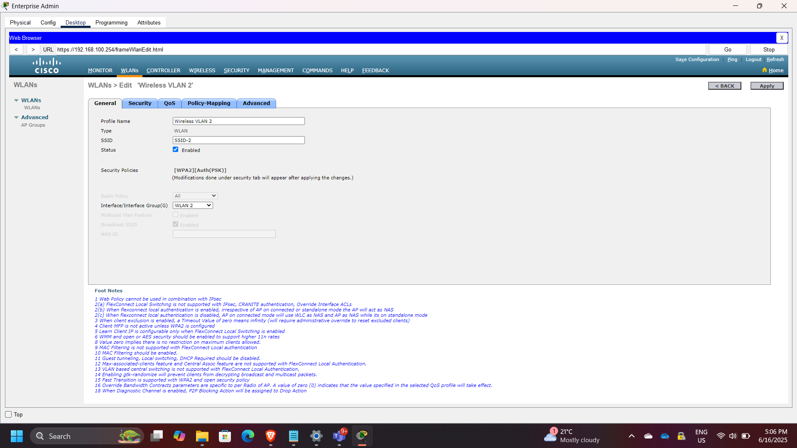
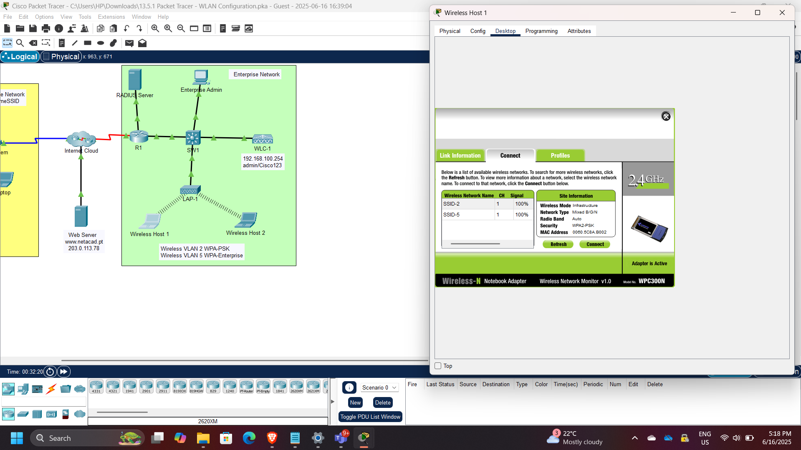
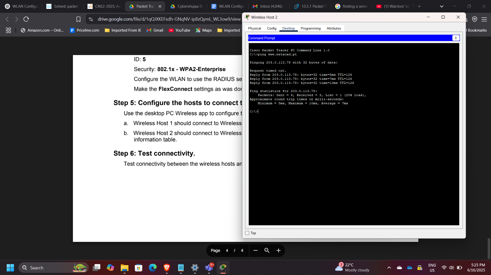

## Project: Enterprise Wireless Network Security Architecture using Cisco WLC

**Timeline:** June 2025  
**Role:** Network Security Engineer  
**Platform:** Cisco Packet Tracer  
**Focus:** Secure Wireless Network Design, WPA2 Authentication, VLAN Segmentation, Centralized WLAN Control  

---

## Executive Summary

Designed and implemented both home and enterprise wireless network environments using Cisco Packet Tracer. The project demonstrated how secure wireless access can be achieved through proper WLAN configuration, VLAN segmentation, and centralized wireless network management using a Wireless LAN Controller (WLC).

The implementation included:

- Home wireless router configuration with WPA2-Personal security
- Enterprise WLAN deployment using Cisco WLC
- VLAN segmentation for multiple wireless networks
- RADIUS-based authentication for WPA2-Enterprise
- DHCP configuration for wireless management networks
- Verification of wireless client connectivity

This project reinforced practical skills in wireless security architecture and enterprise WLAN deployment.

---

## Wireless Network Architecture

The architecture includes:

- Wireless clients
- Home wireless router
- Cisco Wireless LAN Controller (WLC)
- Wireless VLAN interfaces
- RADIUS authentication server
- DHCP services for wireless management
- Segmented enterprise WLANs

---

## Part 1: Home Wireless Router Configuration

A home wireless router was configured to provide secure wireless access using **WPA2-Personal (Pre-Shared Key)** authentication.

### DHCP Configuration

Router DHCP settings were configured with gateway address:

`10.100.200.2`

This allowed the router to assign IP addresses automatically to connected wireless clients.

### Wireless LAN Configuration

The wireless LAN was configured with:

- SSID settings
- Basic wireless parameters
- WPA2-Personal authentication
- Shared passphrase security

### Wireless Security Configuration

Security settings were configured using:

- WPA2-Personal
- AES encryption
- Shared passphrase authentication

---

## Part 2: Enterprise WLAN Using Cisco WLC

An enterprise wireless environment was implemented using a **Cisco Wireless LAN Controller (WLC)** to centrally manage wireless networks, VLANs, and authentication policies.

The enterprise configuration included:

- Multiple WLANs
- VLAN segmentation
- RADIUS integration
- DHCP scope creation
- Centralized wireless control

---

## VLAN Interface Configuration

Separate VLAN interfaces were created for distinct wireless networks.

Examples included:

- Wireless VLAN 2
- Wireless VLAN 5

This enabled segmentation between wireless client groups.

---

## DHCP Scope Configuration

A DHCP scope was configured for the wireless management network to dynamically assign IP addresses to wireless clients.

---

## External Server Configuration

The WLC was configured to use external infrastructure services, including:

- RADIUS server for authentication
- SNMP server for logs and monitoring

---

## WLAN Creation

Two wireless networks were created on the controller.

### WLAN 1
Configured using **WPA2-Personal (PSK)**.

### WLAN 2
Configured using **WPA2-Enterprise** with **RADIUS-based authentication**.

This demonstrates the difference between consumer-grade and enterprise-grade wireless security models.

---

## Wireless Client Authentication

Wireless hosts were connected to different WLANs according to authentication requirements.

| Host | WLAN | Authentication |
|------|------|----------------|
| Wireless Host 1 | VLAN 2 | WPA2-PSK |
| Wireless Host 2 | VLAN 5 | WPA2-Enterprise |

---

## Connectivity Verification

Connectivity between wireless hosts and network resources was verified using:

- ICMP ping tests
- DHCP lease verification
- End-to-end host communication

---

## Security Concepts Demonstrated

This project demonstrated several important wireless security principles:

- WPA2 wireless encryption
- Pre-shared key authentication
- Enterprise RADIUS authentication
- VLAN-based segmentation
- Centralized wireless management using WLC
- DHCP-based client provisioning
- Separation between home and enterprise wireless security models

---

## Enterprise Relevance

Wireless networks are often one of the most exposed entry points in enterprise environments. Proper configuration of WLAN authentication, segmentation, and centralized management is essential to reduce unauthorized access risk and strengthen network security posture.

This project demonstrates practical implementation of secure wireless architecture using Cisco enterprise networking components.

---

## Conclusion

This project successfully demonstrated the design and deployment of secure wireless networks in both home and enterprise environments. By implementing WPA2-Personal and WPA2-Enterprise authentication, configuring VLAN segmentation, and using a Cisco Wireless LAN Controller for centralized management, the solution reinforced key concepts in wireless security and enterprise network design.

---

[Back to Security Projects](/projects/security/)
